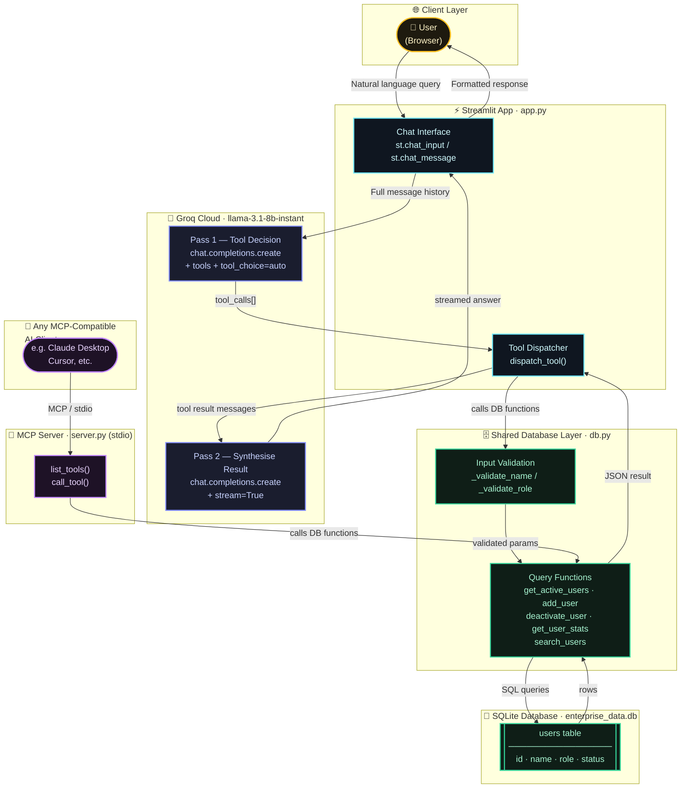

# Enterprise Data Agent 🗄️

A natural-language interface to an enterprise employee database, powered by **Groq LLM** tool-calling and a local **SQLite** database, with a **Streamlit** frontend and a **Model Context Protocol (MCP)** server backend.

---

## Architecture




---

## Quick Start

### 1. Prerequisites
- Python 3.11+
- A [Groq API key](https://console.groq.com/)

### 2. Clone & Set Up
```bash
git clone <your-repo-url>
cd mcp_project

# Create and activate a virtual environment
python -m venv venv
venv\Scripts\activate        # Windows
# source venv/bin/activate   # macOS/Linux

# Install dependencies
pip install -r requirements.txt
```

### 3. Configure Environment
Create a `.env` file in the project root (`F:\PROJECTS\MCP\.env`):
```
GROQ_API_KEY=gsk_your_key_here
GROQ_MODEL=llama-3.3-70b-versatile   # optional, this is the default
```

### 4. Initialize the Database
```bash
# From the project root (F:\PROJECTS\MCP\)
sqlite3 enterprise_data.db < schema.sql
```

### 5. Run the App
```bash
# From F:\PROJECTS\MCP\
streamlit run mcp_project/app.py
```

Open [http://localhost:8501](http://localhost:8501) in your browser.

---

## Available Tools

The LLM can call these tools automatically based on your query:

| Tool | Description |
|------|-------------|
| `get_active_users` | List all active users and their roles |
| `add_user` | Add a new user (name + role) |
| `deactivate_user` | Deactivate an active user by name |
| `get_user_stats` | Get total, active, and inactive counts |
| `search_users` | Search users by name fragment |

---

## Example Queries

- *"Who are our active users?"*
- *"Add Jane Doe as a Manager"*
- *"How many users do we have in total?"*
- *"Search for users named Alice"*
- *"Deactivate Bob Jones"*
- *"Show me user statistics"*

---

## Running the MCP Server (Standalone)

`server.py` exposes the same tools via the [Model Context Protocol](https://modelcontextprotocol.io/) over stdio, for use with any MCP-compatible AI client:

```bash
python mcp_project/server.py
```

---

## Project Structure

```
F:\PROJECTS\MCP\
├── .env                    # ← API key (never commit this!)
├── .gitignore
├── requirements.txt
├── schema.sql              # DB schema — use to recreate the database
├── enterprise_data.db      # SQLite database (gitignored)
└── mcp_project\
    ├── app.py              # Streamlit frontend
    ├── server.py           # MCP stdio server
    └── db.py               # Shared database access layer
```

---

## Security Notes

- **Never commit your `.env` file.** The `.gitignore` excludes it.
- **Never commit `enterprise_data.db`.** Use `schema.sql` to recreate it.
- Rotate your Groq API key at [console.groq.com](https://console.groq.com/) if it has ever been exposed.
