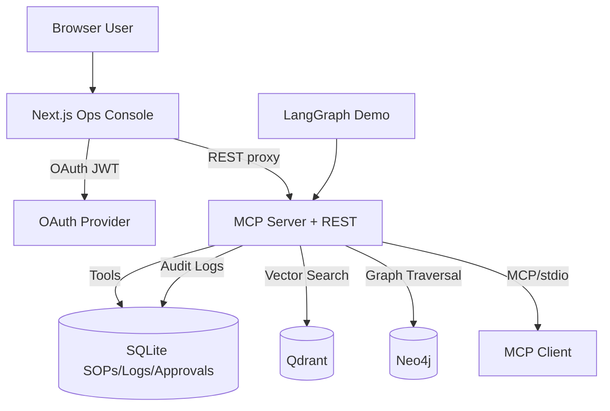

# Enterprise MCP Operations Console

Enterprise-grade Model Context Protocol server with secure tool execution, hybrid retrieval, and human-in-the-loop approvals. Includes a Next.js UI, Docker deployment, and GitHub Actions validation.

## Architecture



## Why these schemas

- SOPs and system logs model real enterprise workflows and incident response.
- Graph entities and edges support relationship-aware retrieval for dependency reasoning.
- Audit logs and approval requests enable traceability and HITL governance.

## Core MCP primitives

- Resources: SOP catalog, recent logs, graph entities, plus schema.
- Tools: deterministic JSON schema per tool, including sensitive tool gating.
- Prompts: dynamic ops assistant prompt adapting to role and incident level.

## Security model

- OAuth/JWT verification at the MCP layer via JWKS.
- Scope-based authorization per tool.
- Full audit logging for all tool calls.
- HITL approval queue for sensitive actions.

## Quick start (local)

### 1) Setup Python

```bash
python -m venv venv
venv\Scripts\activate
pip install -r requirements.txt
```

### 2) Initialize SQLite

```bash
sqlite3 enterprise_data.db < schema.sql
```

The server auto-initializes the database if the file is missing.

### 3) Run MCP server (SSE)

```bash
set MCP_AUTH_REQUIRED=false
python mcp_project/server.py --transport sse --port 8000
```

### MCP server env vars

```
MCP_AUTH_REQUIRED=true|false
MCP_JWKS_URL=
MCP_ISSUER=
MCP_AUDIENCE=
QDRANT_URL=http://localhost:6333
QDRANT_API_KEY=
NEO4J_URI=bolt://localhost:7687
NEO4J_USER=neo4j
NEO4J_PASSWORD=password
```

See [.env.example](.env.example) and [next-app/.env.example](next-app/.env.example).

### 4) Seed hybrid backends (optional)

```bash
python scripts/seed_hybrid.py
```

## Next.js UI

### 1) Install deps

```bash
cd next-app
npm install
npm run dev
```

### 2) Env vars (Next.js)

```
MCP_BASE_URL=http://localhost:8000
MCP_DEV_TOKEN=<optional-dev-token>
NEXT_PUBLIC_CLERK_PUBLISHABLE_KEY=
CLERK_SECRET_KEY=
CLERK_JWT_TEMPLATE=
```

The UI uses Clerk for OAuth. If OAuth is not configured, provide `MCP_DEV_TOKEN` and set `MCP_AUTH_REQUIRED=false` on the server.

## Docker

```bash
docker compose up --build
```

Services:
- MCP server on 8000
- Next.js UI on 3000
- Neo4j on 7474/7687
- Qdrant on 6333

## Orchestrator demo (LangGraph)

```bash
set MCP_API_URL=http://localhost:8000/api
set MCP_TOKEN=<your-jwt>
python orchestrator/langgraph_demo.py
```

## MCP tools and resources

See [mcp_project/server.py](mcp_project/server.py) for full tool definitions. Resources are exposed for SOPs, logs, graph entities, and schema.

## CI/CD

GitHub Actions builds Python and Next.js, validates the schema, and builds Docker images. See [.github/workflows/ci.yml](.github/workflows/ci.yml).

## Repository map

- [mcp_project/server.py](mcp_project/server.py) MCP server + REST proxy
- [mcp_project/db.py](mcp_project/db.py) SQLite access layer
- [mcp_project/hybrid.py](mcp_project/hybrid.py) Qdrant + Neo4j adapters
- [schema.sql](schema.sql) data model
- [next-app](next-app) Next.js ops console
- [docker-compose.yml](docker-compose.yml) local stack
